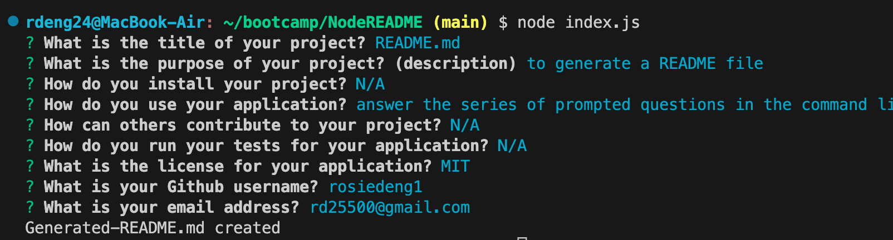

#README Generator using Node 

## Description

The motivation behind the project was for a user to be able to generate a professional README file based on a series of prompted questions that are asked to the user using the command line through the inquirer package with node js. Those answers input by the user are saved in a markdown format. We built this project because it creates an easy and efficient way for users to generate a README in the proper format without having to do it from scratch. It solves the problems of allowing a user to input information for the corresponding README section (installation, contributing, description, etc) so that others can understand how to use the application and the purpose behind the application. I learned a lot about using template literals, understanding how promises work and understanding how numerous files (generateMarkdownjs and index.js) can come together to function correctly. 

## Usage
Link to video showing how the application works: https://drive.google.com/file/d/1as2zbVVPQHw1JUvR49W2v-3LW07QvT3S/view

Instructions for ![Questions]: Type node index.js in the command line to invoke the application which will then ask the user to answer a series of prompted questions 
Instructions for ![Answers]: After you type in all your answers to the questions, a README file will be generated 
Instructions ![GeneratedREADME]: Shows the open preview page for your generated README

## Credits

fs.writeFile() method: https://www.geeksforgeeks.org/node-js-fs-writefile-method/amp/
.then() method: https://developer.mozilla.org/en-US/docs/Web/JavaScript/Reference/Global_Objects/Promise/then

## License

Please refer to the LICENSE in the repo.
